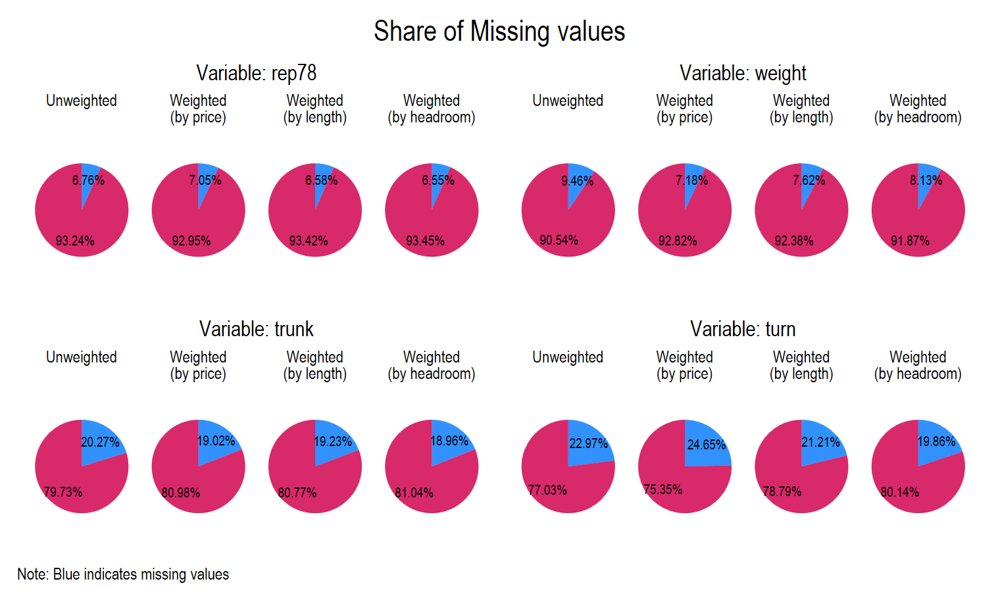

# Small STATA packages
This is my space for small packages that I coded as an RA to make my life a little easier when working with large datasets. 

## wmc

This is a small STATA package that can be interpreted as an extension to the _mdesc_ command in STATA and allows for (multiple) weights when investigating missing values. You specify the variables for which you want to see the number of missing values and then specify the variable(s) by which you want to weight the missingness. This allows researchers to see that if a variable misses 5% of its observations whether when weighted this corresponds to 1% or 50% of another variable indicating how important the missing values are. 

### Installation 

To use the `wmc` command you can use the following code to install the package from GitHub (**v2.0**):

```
net install wmc, from("https://raw.githubusercontent.com/jjkrueg/STATA-peanuts/main/Installation") replace
```

Even if you have the package installed, make sure that it is updated `ado update, update`.

### Syntax

```
wmc [varlist] [if] [in] [, ABbreviate(integer 12) wv(string) GRaph]
```

We start by writing wmc which stands for weighted missingness count. We can specify the typical `if` and `in` clauses as well as the conventional abbrevation command known from the mdesc command. The innovation of this command allows for the weighting variable `wv`. Before doing any calculations the command checks that there is less than four weighting variables, the weighting variables are never missing and that the weighting variables are in numeric format. 

### Use

#### Single weights

```
sysuse auto, clear
qui replace mpg = . if mpg == 16
wmc mpg, wv(price)
```

Which then yields the following output:

```
1. Weighting variable: price

    Variable    |     Missing          Total     Percent Missing      Weighted Missing
----------------+----------------------------------------------------------------------
            mpg |           4             74           5.41           7.09

Weighting variable statistics

    Variable    |       Sum            Mean
----------------+--------------------------------
          price |    456,229       6,165.26
```

#### Multiple weights

You can specify multiple weights easily and multiple test variables easily by writing as such:

```
wmc rep78 weight trunk turn, wv(price length headroom)
```

With the below modificaitons to the pre-installed auto dataset this command will yield the following output. 

```
sysuse auto, clear
	replace trunk = . if inrange(trunk, 11, 13)
	replace weight = . if weight < 2000
	replace turn = . if inrange(turn, 36, 39)
wmc rep78 weight trunk turn, wv(price length headroom)
```

```
1. Weighting variable: price
2. Weighting variable: length
3. Weighting variable: headroom

    Variable    |     Missing          Total     Percent Missing      Weighted Missing 1      Weighted Missing 2      Weighted Missing 3
----------------+-----------------------------------------------------------------------------------------------------------------------
          rep78 |           5             74           6.76           7.05                     6.58                     6.55
         weight |           7             74           9.46           7.18                     7.62                     8.13
          trunk |          15             74          20.27          19.02                    19.23                    18.96
           turn |          17             74          22.97          24.65                    21.21                    19.86

Weighting variable statistics

    Variable    |     Sum          Mean
----------------+--------------------------------
          price |    456,229       6,165.26
         length |     13,907         187.93
       headroom |        222           2.99

```

#### Exploring the graphing option

The package also includes a convenient grpahing option that allows users to visualise the missing observations for different variables and different weights. To use the option simply add the option graph at the end of the code like this:

```
wmc rep78 weight trunk turn, wv(price length headroom) graph
```

which will produce a series of pie charts that look like this:



#### Alternate missing values

Sometimes one is aware of certain values that are equivalent to missing values in a dataset such as -99 or -7. If one wants to add those values to the consideration one can simply and without changing the underlying dataset specify the `mvals' option. See below the explained example:

```
sysuse auto, clear
wmc_3 rep78
replace rep78 = -9 if rep78 == 1
wmc_3 rep78, mvals(-9)
```

```
 wmc_3 rep78

    Variable    |     Missing          Total     Percent Missing
----------------+-----------------------------------------------
          rep78 |           5             74           6.76


wmc_3 rep78, mvals(-9)

List of values considered missing: . , -9 

    Variable    |     Missing          Total     Percent Missing
----------------+-----------------------------------------------
          rep78 |           7             74           9.46
```


#### Grouped patterns of misssingness

Suppose one has a continuous varible such as weight or price and one has several groups as in the STATA default auto dataset. To check how missing values are distributed across different subgroups of a grouping variable one can use the `groups` option. This option will create the usual output for the entire variable in addition to the subgroup statistics:

```
wmc rep78, groups(foreign)
```

```
wmc_3 rep78, gr(foreign)

Grouping variable: foreign

    Variable    |     Missing          Total     Percent Missing
----------------+-----------------------------------------------
          rep78 |           5             74           6.76
       foreign: |
              0 |           4             52           7.69
              1 |           1             22           4.55
                |

```

For this function one can also specify all the other options on weights, graphs and alternate missing values as described above. 

## Other projects (under development)

1. Further graphing options
2. Add analysis of the patterns of missingness (similar to naniar package in R)
3. Add a nifty visualisation for missingness by defined groups (extension to by command)

